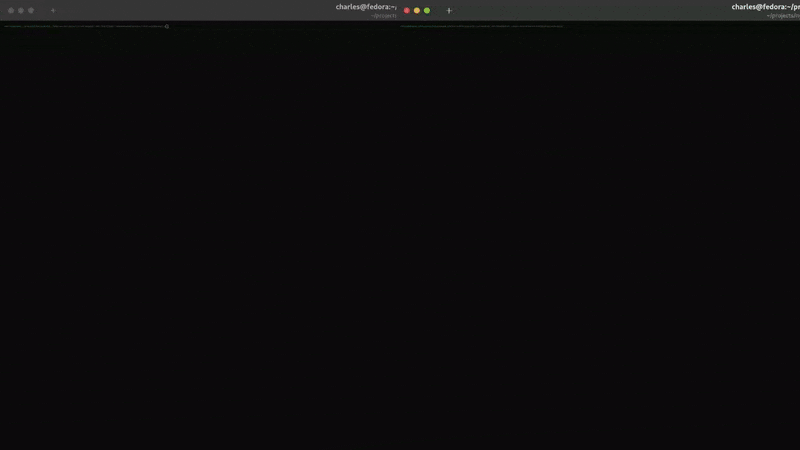
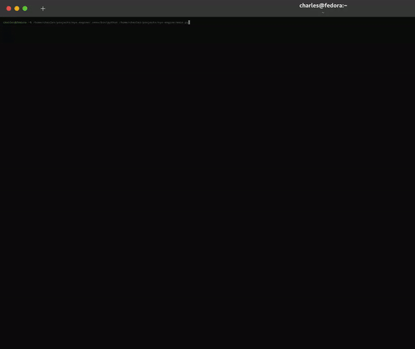

# NyxEngine
An experimental, high-performance game engine and rendering pipeline for the terminal. Written in Python with NumPy.

[](https://cmorman89.github.io/nyx-engine/)

---

 Table of Contents:
- [NyxEngine](#nyxengine)
  - [Status Update:](#status-update)
    - [**Release v0.1.1-alpha:** _(01/03/2025)_](#release-v011-alpha-01032025)
    - [**Release v0.1.0-alpha:** _(12/27/2024)_](#release-v010-alpha-12272024)
  - [Overview:](#overview)
  - [Technical Highlights:](#technical-highlights)
  - [Setup/Run:](#setuprun)
  - [Usage:](#usage)
  - [Concept/Demo:](#conceptdemo)
  - [Recent Changelog:](#recent-changelog)
    - [\[0.1.1-alpha\] - 2025-01-03](#011-alpha---2025-01-03)
    - [\[0.1.0-alpha\] - 2024-12-27](#010-alpha---2024-12-27)
  - [Project Roadmap:](#project-roadmap)
    - [Implemented Features:](#implemented-features)
    - [Expected Features:](#expected-features)
  - [Cosmology/Mythology:](#cosmologymythology)
  - [License](#license)
    - [Full License:](#full-license)
  - [Contact](#contact)

---

## Status Update: 

### **Release v0.1.1-alpha:** _(01/03/2025)_
> ### **Further Optimizations**
>
> This update further optimizes the terminal printing performance by refactoring the `HemeraTermFx` class. The `NyxEngine` class has been updated to enforce game state consistency across the project, holding all instances of the major subclasses. Additionally, the `requirements.txt` file now includes `line_profiler` for performance testing to fix missing dependencies.
>
> I will probably begin transitioning parts of the project to C because the Python interpreter is not fast enough for the performance I want to achieve. Once the transition is complete, I will be able to focus on implementing more complex features and optimizations that are currently out of reach due to Python's limitations. I am excited about the possibilities that this transition will open up and look forward to sharing the progress with you all.
>
> _Benefits using C include:_
> - Allocatae memory for the various frame buffers and arrays and manage them directly.
> - Drastically improve the performance of the printing pipeline by speeding up the string buffer loop.
> - Improve printing performance by directly printing bytes to the terminal.
> - Completely avoid string generation for the terminal output by generating the ANSI escape sequences directly as bytes stored in a dedicated buffer.
> 
> _What this means:_
> - Implement *full color support* for 24-bit RGB colors (!!!)
> - Allow real-time conversion of video files to terminal output.
> 
> 
### **Release v0.1.0-alpha:** _(12/27/2024)_
> ### **Major Performance Gain** 
> 
> The latest release, v0.1.0-alpha, introduces significant performance improvements to the printing speed of the engine. When printing to the terminal, the ndarrays (frames) must be converted to a printable string format. Profiling the code revealed that this conversion was the significant bottleneck in the terminal printing process. After a many, _many_ rounds of line profiling and optimizing the string generation, the printing speed of a 640x480 resolution frame has improved by 95%, from 0.0954 seconds per frame to 0.0069 seconds per frame -- while still running on a single thread.
>
> This optimization significantly enhances the engine's performance and opens up new possibilities for more complex and faster-rendering games and applications in the terminal. The magnitude of the improvement is such that a minor version bump is well-warranted, despite the lack of any new or major feature.
>
> The GIF below demonstrates the printing speed difference between the previous release (v0.0.4-alpha) and the current release (v0.1.0-alpha).

> |  |
> |:--:|
> | **Printing speed of V0.0.4-alpha** _(left, 0.0954 sec/frame)_ **vs v0.1.0-alpha** _(right, 0.0069 sec/frame)_ <br> _Internal Resolution: 640 x 480_  |

---

## Overview:
NyxEngine is a proof-of-concept game engine and rendering pipeline that outputs to a text-based terminal. It aims to push the boundaries of terminal rendering, with no guarantee of success.

For now, it requires a little... _imagination_.

|  |
|:--:|
| *(GIF rendered in the terminal via release v0.0.4-alpha.)* |

---

## Technical Highlights:
- #### Subpixel Rendering in the Terminal:
  - Achieves increased fidelity by simulating higher resolution with foreground/background ANSI colors and special characters like ▀.
- #### Delta Framebuffer Rendering:
  - Optimizes performance by updating only the pixels that change between frames, minimizing the computational cost of terminal rendering.
- #### 256-Color Extended ANSI Support:
  - Uses the full spectrum of ANSI 256-color codes for vibrant, high-quality output. Avoids unpredictable custom palette issues by skipping colors 0-15.
- #### Layered Z-Index Rendering:
  - Enables priority-based composition by merging layers from highest to lowest, ensuring accurate display of overlapping objects.
- #### Efficient Runbuffer Optimization:
  - Reduces unnecessary ANSI escape sequences, significantly improving rendering speed by issuing updates only when colors or cursor positions change.
- #### Python-Powered with NumPy:
  - Utilizes 3D NumPy arrays for efficient handling of color stacks, enabling fast computations and smooth animations in the terminal environment.

---

## Setup/Run:
The current release displays a demo of a starship flying through space and firing lasers. I was hoping to have a better demo for this release, but I needed to push an update to fix some architechtural and documentation issues. The next release will have a more polished demo. Check out the npz.py file in the feature/demo-files branch for a sneak peek at the next release.

*1. Clone the repository:*
  - > ```bash
    > git clone https://github.com/cmorman89/nyx-engine
    > ```
*2. Change to the NyxEngine directory:*
  - > ```bash
    > cd nyx-engine
    > ```
*3. Install Dependencies:*
  - > ```bash
    > pip install numpy pytest line_profiler
    > ```
*4. Run the project main file:*
  - > ```bash
    > python main.py
    > ```

---

## Usage:
The current release is able to render animated sprites and tilemaps to the terminal. The engine is still in its early stages, with many features yet to be implemented. Until the engine is more mature, the primary use case is for experimentation and exploration of terminal rendering capabilities. Detailed usage instructions will be provided once the engine has better-defined workflows and features.

---

## Concept/Demo:

The current state of NyxEngine is demonstrated in the following space-shooter example, showcasing the engine's capabilities in rendering animated sprites and tilemaps to the terminal.

|  | 
|:--:|
| **Space shooter game in the terminal via release v0.0.4-alpha.**<br> *Note:Output is much smoother than captured.* |

---

Using the NyxEngine rendering pipeline, the following examples demonstrate the rendering of a DOOM and a cartoon GIF in the terminal. These were created by pre-converting the original GIF frames into NyxEngine-compatible frames for rendering.

At some point, I hope to have a fully functional DOOM game running in the terminal. For now, this is a proof of concept to test the viability and limitations of rendering a game like DOOM in the terminal.

|  |
|:--:|
| **DOOM rendered in the terminal via release v0.0.4-alpha.** <br> *Note: Not (yet) playable. This is a PoC using the NyxEngine rendering pipeline on pre-output frames from DOOM.* |

|  |
|:--:|
| **GIF rendered in the terminal via release v0.0.4-alpha.** |

---

NyxEngine’s subpixel and color rendering capabilities are demonstrated with this example, rendering `spaceship.png` directly to the terminal. This image utilizes:
1. **256-color extended ANSI codes.**
2. **Subpixel rendering** for increased fidelity without additional character usage by using the stacked block character (▀).


---

## Recent Changelog:

### [0.1.1-alpha] - 2025-01-03
- ### Added
  - Import npz files for multiple frames or sprites.

- ### Changed
  - Refactor `HemeraTermFx` to further optimize terminal printing performance.
  - Update `NyxEngine` as the main enforcer of game state consistency across the project. It now holds all instances of the major subclasses.
  - Update `requirements.txt` to include line_profiler for performance testing.

---

### [0.1.0-alpha] - 2024-12-27
- ### Added
  - New method and hooks in `HemeraTermFx` to enable line profiling for performance testing.
  - GIF demos in the `examples\demos` folder to showcase the project's capabilities.
  - Add an alient planet sprite to the current game demo in `main.py`.

- ### Changed
  - Optimize terminal printing string generation for a 95% reduction in frame printing time.


See the full [changelog here](CHANGELOG.md).

---

## Project Roadmap:
  ### Implemented Features:
   - **Printing:**
     - Use 256-color extended ANSI
       - Note: This excludes codes 0-15 as these often use custom color palettes in each terminal -- making for unpredictable color output.
     - Delta-only rendering to optimize performance by updating only changed pixels.
       - Compares the current and last subpixel array frame to detect and retain changes.
       - Maintains color integrity of paired color data by including both foreground and background color, even if only one has changed.
     - Runbuffer detection for both foreground and background colors, significantly reducing the performance cost of reissuing ANSI escape sequences.
       - Only issues ANSI excape codes when required for a cursor relocation or a color change.
     - Subpixel rendering
       - Simulates higher resolution using foreground/background colors and special characters (e.g., ▀).
       - Stored in a 3D NumPy array to create a "stack" of the fg/bg color pair.
   - **Rendering:**
     - Create intermediate subframes for each z-index, where the matching z-indexed entity can be drawn onto.
     - Use the z-indicies as priorities to collapse the subframes into a final merged frame.
       - Starts at the highest z-index and value and works down, essentially "filling in" only pixels that are still transparent/unoccupied after each layer merge. This creates a prioritized merge system that respects the layer hierarchy.
       - Any remaining transparency after merging is filled by a static background color, if set.
     - Render animated, infinitely scrolling tilemaps.
     - Render animated sprites to the terminal with velocity and position updates.
   - **Game Engine:**
     - Basic game loop with a fixed timestep.
     - Basic entity-component-system (ECS) architecture.
   - **Data:**
     - Load textures from .npz files (matrix array in plain text).
 
  ### Expected Features:

   - **Data:**
     - Save and load assets to JSON for easy sharing.
     - Save and load assets to PNG for external tools.

   - **Engine:**
     - Side-scrolling games.
     - Room-based map exploration.
     - Open-world environments.
     - Full keyboard support for input handling.

   - Plus more to come as the project evolves!

---

## Cosmology/Mythology:
This project is thematically named after some of the oldest Greek gods, which rather poetically flows with comparatively "ancient" underpinnings of a text-based terminal.

- ### Nyx (`NyxEngine`):
  - In the Greek pantheon, Nyx is a primordial goddess who personifies the night, predating even the
    Olympian gods. She is the daughter of Chaos, the first primordial entity, and the mother of
    numerous powerful deities, including Moros (Doom), Aether (Upper Air), and Hemera (Day). Nyx
    commands immense power and influence, earning the respect and fear of even the mighty Olympians,
    who are said to tremble in her presence. Her dominion over the night and all that it encompasses
    makes her one of the most enigmatic and formidable forces in the cosmos. Despite her vast power,
    Nyx's role is often more subtle, as she works behind the scenes to shape the course of events in
    the universe​.

- ### Moirai (`MoiraiECS`):
  - The Moirai are better known as the Fates and are children of Nyx (source depending). Together,
    the three sisters determine the destiny and fate of both mortals and divine beings, alike.
    Clotho spins the thread representing the start of life; Lachesis allots the path that life will
    follow; and Atropos cuts the thread, ending that life's journey.


- ### Aether (`AetherRenderer`): 
  - Aether is the son of Nyx (Night) and Erebus (Darkness). He personifies the upper air—the pure,
    bright atmosphere breathed by the gods. Aether is also considered the ethereal medium through
    which the divine realm is perceived, representing the luminous, untainted essence that fills the
    heavens.

- ### Hemera (`HemeraTermFx`):
  - Hemera is the personification of day and light, the daughter of Nyx
    (Night) and Erebus (Darkness). As the embodiment of light, she dispels the shadows of night,
    bringing clarity and illumination to creation and all within it​

---

## License

NyxEngine is licensed under the **MIT License**.

You are free to use, modify, and distribute this software for personal or commercial purposes, provided that you include the original copyright notice and this permission notice in any copies or substantial portions of the software.

### Full License:
See the [LICENSE](LICENSE) file.

---

## Contact
Contact: nyx-engine@cmorman.com.