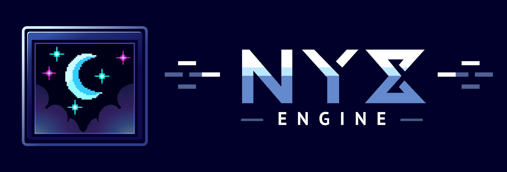
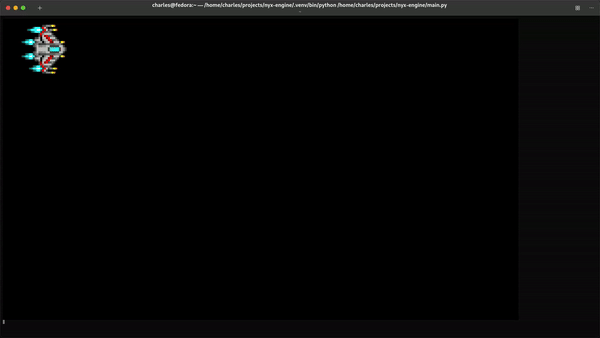
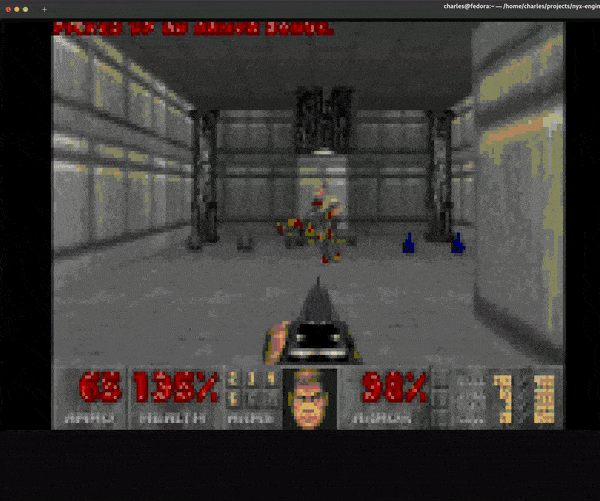
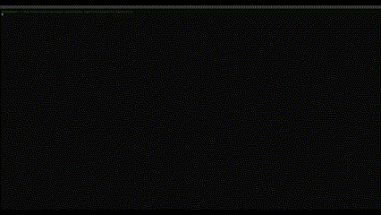
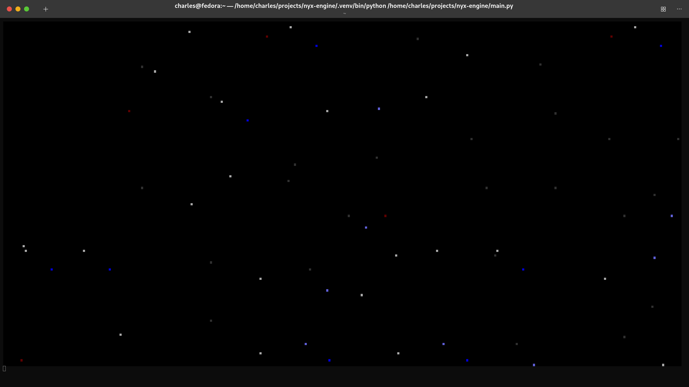

# NyxEngine
An experimental, high-performance game engine and rendering pipeline for the terminal. Written in Python with NumPy.



---

 Table of Contents:
- [NyxEngine](#nyxengine)
  - [](#)
  - [Overview:](#overview)
  - [Technical Highlights:](#technical-highlights)
  - [Setup/Run:](#setuprun)
  - [Concept/Demo:](#conceptdemo)
  - [Project Roadmap:](#project-roadmap)
    - [Implemented Features:](#implemented-features)
    - [Expected Features:](#expected-features)
  - [Cosmology/Mythology:](#cosmologymythology)
  - [License](#license)
    - [Full License:](#full-license)
  - [Contact](#contact)

---

## Overview:
NyxEngine is a proof-of-concept game engine and rendering pipeline that outputs to a text-based terminal. It aims to push the boundaries of terminal rendering, with no guarantee of success.

For now, it requires a little... _imagination_.

|  |
|:--:|
| *(Rendered in the terminal via release v0.0.3-alpha.)* |

---

## Technical Highlights:
- #### Subpixel Rendering in the Terminal:
  - Achieves increased fidelity by simulating higher resolution with foreground/background ANSI colors and special characters like ▀.
- #### Delta Framebuffer Rendering:
  - Optimizes performance by updating only the pixels that change between frames, minimizing the computational cost of terminal rendering.
- #### 256-Color Extended ANSI Support:
  - Uses the full spectrum of ANSI 256-color codes for vibrant, high-quality output. Avoids unpredictable custom palette issues by skipping colors 0-15.
- #### Layered Z-Index Rendering:
  - Enables priority-based composition by merging layers from highest to lowest, ensuring accurate display of overlapping objects.
- #### Efficient Runbuffer Optimization:
  - Reduces unnecessary ANSI escape sequences, significantly improving rendering speed by issuing updates only when colors or cursor positions change.
- #### Python-Powered with NumPy:
  - Utilizes 3D NumPy arrays for efficient handling of color stacks, enabling fast computations and smooth animations in the terminal environment.

---

## Setup/Run:
The current release (as of v0.0.3-alpha) is able to create a functional output of an animated tilemap. This demo can be viewed on Unix systems by following these steps:

*1. Clone the repository:*
  - > ```bash
    > git clone https://github.com/cmorman89/nyx-engine
    > ```
*2. Make the 'run' script executable:*
  - > ```bash
    > cd nyx-engine
    > sudo chmod u+x run.sh
    > ```
*3. Run the project demo file:*
  - > ```bash
    > ./run.sh
    > ```

---

## Concept/Demo:
NyxEngine’s rendering capabilities are demonstrated with this example, rendering `spaceship.png` directly to the terminal. This image utilizes:
1. **256-color extended ANSI codes.**
2. **Subpixel rendering** for increased fidelity without additional character usage.


---

Here is another example of a nostalgic side-scrolling space scene. The artifacting is from the GIF
conversion process and isn't present in the terminal. The judder has been amplified by the GIF as
well.

|  |
|:--:|
| *(Rendered in the terminal via release v0.0.3-alpha.)* |

|  |
|:--:|
| *(Rendered in the terminal via release v0.0.3-alpha.)* |

|  |
|:--:|
| *(Rendered in the terminal via release v0.0.3-alpha.)* |


---

## Project Roadmap:
  ### Implemented Features:
   - **Printing:**
     - Use 256-color extended ANSI
       - Note: This excludes codes 0-15 as these often use custom color palettes in each terminal -- making for unpredictable color output.
     - Delta-only rendering to optimize performance by updating only changed pixels.
       - Compares the current and last subpixel array frame to detect and retain changes.
       - Maintains color integrity of paired color data by including both foreground and background color, even if only one has changed.
     - Runbuffer detection for both foreground and background colors, significantly reducing the performance cost of reissuing ANSI escape sequences.
       - Only issues ANSI excape codes when required for a cursor relocation or a color change.
     - Subpixel rendering
       - Simulates higher resolution using foreground/background colors and special characters (e.g., ▀).
       - Stored in a 3D NumPy array to create a "stack" of the fg/bg color pair.
   - **Rendering:**
     - Create intermediate subframes for each z-index, where the matching z-indexed entity can be drawn onto.
     - Use the z-indicies as priorities to collapse the subframes into a final merged frame.
       - Starts at the highest z-index and value and works down, essentially "filling in" only pixels that are still transparent/unoccupied after each layer merge. This creates a prioritized merge system that respects the layer hierarchy.
       - Any remaining transparency after merging is filled by a static background color, if set.
       - 
  ### Expected Features:

   - **Data:**
     - Save and load assets to JSON for easy sharing.
     - Save and load assets to PNG for external tools.

   - **Engine:**
     - Side-scrolling games.
     - Room-based map exploration.
     - Open-world environments.
     - Full keyboard support for input handling.

   - Plus more to come as the project evolves!

---

## Cosmology/Mythology:
This project is thematically named after some of the oldest Greek gods, which rather poetically flows with comparatively "ancient" underpinnings of a text-based terminal.

- ### Nyx (`NyxEngine`):
  - In the Greek pantheon, Nyx is a primordial goddess who personifies the night, predating even the
    Olympian gods. She is the daughter of Chaos, the first primordial entity, and the mother of
    numerous powerful deities, including Moros (Doom), Aether (Upper Air), and Hemera (Day). Nyx
    commands immense power and influence, earning the respect and fear of even the mighty Olympians,
    who are said to tremble in her presence. Her dominion over the night and all that it encompasses
    makes her one of the most enigmatic and formidable forces in the cosmos. Despite her vast power,
    Nyx's role is often more subtle, as she works behind the scenes to shape the course of events in
    the universe​.

- ### Moirai (`MoiraiECS`):
  - The Moirai are better known as the Fates and are children of Nyx (source depending). Together,
    the three sisters determine the destiny and fate of both mortals and divine beings, alike.
    Clotho spins the thread representing the start of life; Lachesis allots the path that life will
    follow; and Atropos cuts the thread, ending that life's journey.


- ### Aether (`AetherRenderer`): 
  - Aether is the son of Nyx (Night) and Erebus (Darkness). He personifies the upper air—the pure,
    bright atmosphere breathed by the gods. Aether is also considered the ethereal medium through
    which the divine realm is perceived, representing the luminous, untainted essence that fills the
    heavens.

- ### Hemera (`HemeraTermFx`):
  - Hemera is the personification of day and light, the daughter of Nyx
    (Night) and Erebus (Darkness). As the embodiment of light, she dispels the shadows of night,
    bringing clarity and illumination to creation and all within it​

---

## License

NyxEngine is licensed under the **MIT License**.

You are free to use, modify, and distribute this software for personal or commercial purposes, provided that you include the original copyright notice and this permission notice in any copies or substantial portions of the software.
NyxEngine is licensed under the **MIT License**.

You are free to use, modify, and distribute this software for personal or commercial purposes, provided that you include the original copyright notice and this permission notice in any copies or substantial portions of the software.

### Full License:
See the [LICENSE](LICENSE) file.
See the [LICENSE](LICENSE) file.

---

## Contact
Contact: nyx-engine@cmorman.com.